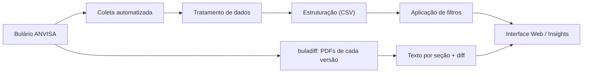

# 📊 DBulário

Plataforma de monitoramento e inteligência regulatória para o Bulário Eletrônico da ANVISA.

---

## 🚀 Visão Geral

O **DBulário** é uma solução que automatiza a coleta, estruturação e análise de dados do Bulário Eletrônico da ANVISA, permitindo o acompanhamento contínuo de atualizações de bulas de medicamentos.

A ferramenta transforma dados públicos dispersos em informação estruturada, rastreável e acionável para equipes de Assuntos Regulatórios.
Saiba mais em: https://dbulario.vercel.app/sobre

---

## 🎯 Objetivo

Eliminar processos manuais e aumentar a eficiência no monitoramento regulatório, proporcionando:

- Visibilidade centralizada das atualizações de bula  
- Rastreabilidade de alterações  
- Redução de risco regulatório  
- Ganho de produtividade operacional  

---

## ⚠️ Problema

O acompanhamento do Bulário da ANVISA apresenta limitações:

- Navegação manual e descentralizada  
- Dificuldade em identificar atualizações recentes  
- Baixa escalabilidade para múltiplos produtos ou empresas  

---

## 💡 Solução

O DBulário automatiza todo o fluxo:

1. Coleta dados diretamente do Bulário  
2. Estrura as informações em formato analítico  
3. Identifica alterações recentes  
4. Permite filtros personalizados  
5. Disponibiliza dados para consulta e análise  

---

## ⚙️ Funcionalidades

- 📥 Coleta automatizada de bulas  
- 🔄 Monitoramento diário de atualizações  
- 📊 Estruturação em CSV / base de dados  
- 🔍 Filtros por:
  - Empresa (CNPJ)
  - Produto
  - Número de registro  
- 🧠 Identificação de medicamentos de referência atualizados  
- 📈 Histórico de versões de cada bula, com o que mudou seção por seção  
- 🌐 Interface web para visualização  

---

## 🧱 Estrutura dos Dados

| Campo           | Descrição                         |
|-----------------|----------------------------------|
| idProduto       | Identificador do produto         |
| numeroRegistro  | Registro ANVISA                  |
| nomeProduto     | Nome do medicamento              |
| expediente      | Expediente                       |
| razaoSocial     | Empresa detentora                |
| cnpj            | CNPJ                             |
| data            | Última atualização identificada  |
| numProcesso     | Número do processo               |
| dataAtualizacao | Última atualização plataforma    |

---

## 🔄 Fluxo de Processamento

---

## 🔍 Versões e diferenças entre bulas

Para os registros acompanhados pelo [buladiff](https://github.com/vasfvitor/buladiff), a plataforma
mostra a linha do tempo de versões de cada bula (paciente e profissional) e, entre duas versões
consecutivas, o que mudou em cada seção da RDC 47/2009, palavra a palavra. O buladiff baixa o PDF de
cada expediente, extrai o texto pela estrutura do documento e publica o resultado como JSON
estático; o DBulário lê esses JSON (variável `VITE_BULADIFF_DATA_URL`, ver `.env.example`).

Cobertura: o que foi publicado no Bulário desde o início da coleta diária, mais uma lista curada.
Na tabela de medicamentos, o botão "Ver versões" aparece só nesses registros. Na dúvida, o PDF no
Bulário da ANVISA é a fonte.

---

## 🌐 Acesso

🔗 https://dbulario.vercel.app/

---

## 📦 Casos de Uso

- Monitoramento regulatório contínuo  
- Inteligência competitiva  
- Auditorias e compliance  
- Suporte a submissões regulatórias  
- Análise de mercado farmacêutico  

---

## 🛠️ Stack

- **Frontend:** React 19, Vite, wouter, Tailwind e shadcn/ui  
- **Backend:** Express + tRPC (função serverless na Vercel)  
- **Data Processing:** Python (ETL / scraping); versões e diffs pelo buladiff  
- **Deploy:** Vercel  
- **Armazenamento:** CSV em `data/` (catálogo) e JSON estáticos do buladiff (versões e diffs)  

Desenvolvimento: `pnpm install`, `pnpm dev` (http://localhost:3000), `pnpm check`, `pnpm test`,
`pnpm build`.

---

## 📈 Diferenciais

- Automação completa do processo  
- Dados estruturados e prontos para análise  
- Escalável para múltiplas empresas  
- Baseado em dados públicos  
- Foco em produtividade regulatória  

---

## 🤝 Contribuição

Acesse: https://dbulario.vercel.app/contato

